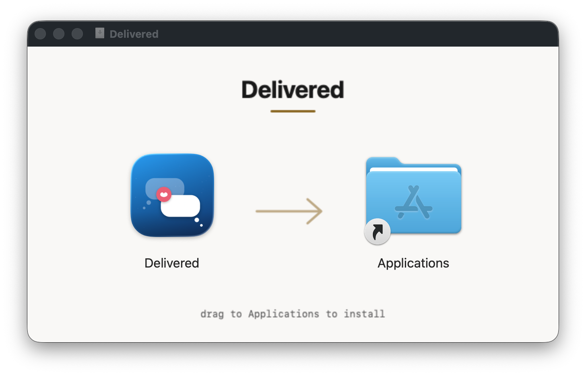

# Delivered

**The advanced view of Messages that Apple never wrote.**

Your Messages history is one of the most valuable personal datasets you
own: years of family life, decisions, jokes, photos, logistics. Apple
gives you almost nothing to do with it -- search is shallow, export does
not exist, there is no API. Delivered is the missing layer: a native
macOS app that turns your Messages archive into something you can
actually search, browse, export, and enjoy.

Everything stays on your Mac. The full product thesis lives in the
[product spec](product-spec.md).

## Install



1. Download the latest DMG from [Releases](../../releases).
2. Drag Delivered to Applications and open it.
3. Grant Full Disk Access when asked -- the Messages database lives
   behind it, and nothing works without it. Contacts access is optional
   and turns raw phone numbers into names and photos everywhere.
   Settings > Permissions shows the whole map: what is required, what
   is optional, and why each exists.
4. The first import reads your entire history in well under a minute,
   with progress shown as message counts. After that the library keeps
   itself current silently.

Requires macOS 14 or later. Signed and notarized with a Developer ID.

## What it does

**Today** is the front door: what happened lately, then "on this day"
across every year you have been texting -- photos and the quotes worth
keeping, different every morning. Every card opens the conversation at
that day.

**Find** is full-text search over your entire history, sub-second at
hundreds of thousands of messages, with operators for precision (see
below). Every result is a door into the conversation at that moment.

**Browse** is the whole archive as one continuous Messages-style
transcript -- bubbles, sender clustering, contact photos, tapbacks,
video posters -- with a year and month index for jumping across a
decade in one click.

**Export** turns any chat into clean Markdown or structured JSON,
filtered by person or date range, previewed before saving, with photos
and videos alongside if you want them. The formats are designed to
drop straight into an LLM context window: export your family chat and
ask Claude questions about it. A one-click "Copy as context" does the
same for search results or a whole conversation, trimmed to a sane
token budget.

**Memories** is the showcase: a fullscreen ambient mode that turns a
chat into art -- photos with a slow Ken Burns drift, message bubbles
from the same era floating over them, tapback bursts, the occasional
stat. It draws only from chats you explicitly include, can start
itself when your Mac goes idle, and ends the moment you touch
anything.

**The archive grows.** Merge another Mac's Messages database and the
libraries combine without duplicates. When Messages splits one group
across multiple threads (it does), stitch them back into a single
conversation. People who text you from both a phone number and an
email resolve to one human everywhere.

## For power users

Search operators compose with free text and with each other:

| operator | meaning |
|---|---|
| `from:sam` / `from:me` | messages from one person (all their handles) or from you |
| `in:"family chat"` | limit to one conversation |
| `before:2024` / `after:2023-06` | date bounds, at year, month, or day precision |
| `has:photo` / `has:video` | messages with media |

Saved searches live in the star menu next to the filters; the query is
the name.

Keyboard: `Cmd+F` search, `Cmd+Shift+M` memories, `Cmd+Z` undoes a
hide, `Cmd+Shift+R` syncs now, `Space`/arrows/`H`/`Esc` inside
memories.

The binary is also a CLI:

```
delivered --status
delivered --export-chat <id> out.md --from sam --after 2024 --photos
delivered --export-archive family.delivered
delivered --merge-db /path/to/other/chat.db
delivered --serve-mcp
```

`--serve-mcp` runs a local MCP server over stdio with three tools --
`search_messages`, `get_transcript`, `list_chats` -- so Claude and any
MCP client can search your archive without your data going anywhere:

```
claude mcp add delivered -- /Applications/Delivered.app/Contents/MacOS/Delivered --serve-mcp
```

## Updates

Updates are unobtrusive by policy: no dialog, ever. The app checks
quietly, downloads in the background, and offers one dismissible line
-- "1.2.1 ready, relaunch" -- in the corner of the sidebar. Ignore it
and the update installs the next time you quit. Automatic checks can
be switched off in Settings.

## Privacy

100 percent local. No accounts, no analytics, no telemetry. Delivered
reads a private, read-only snapshot of your Messages database and never
writes to Messages. The only network call the app ever makes is the
update check against this repository, and it can be turned off.

Curation is absolute: nothing outside the chats you explicitly include
can appear in memories mode, a keyword blocklist is honored everywhere
quotes surface, and hiding a message takes one keystroke.

## Why not the Mac App Store

The App Store requires the App Sandbox, and a sandboxed app cannot read
the Messages database -- which is the entire point. So Delivered ships
the classic Mac way: signed, notarized, direct download, self-updating.

## Colophon

Native Swift and SwiftUI, macOS 14+. Two dependencies: GRDB (SQLite +
FTS5) and Sparkle (updates). Built entirely from the terminal with
swift build and a Makefile; Xcode was never opened. This repository is
the public home -- releases, the update feed, and the product spec. The
source is private for now.

Delivered is not affiliated with Apple. Messages and iMessage are
trademarks of Apple Inc.
