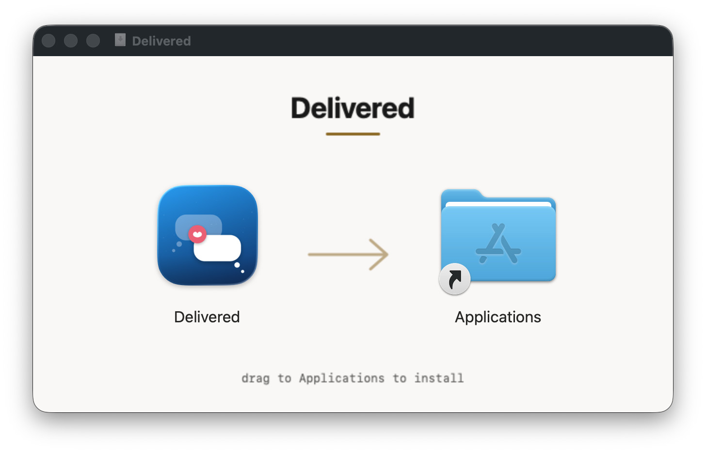
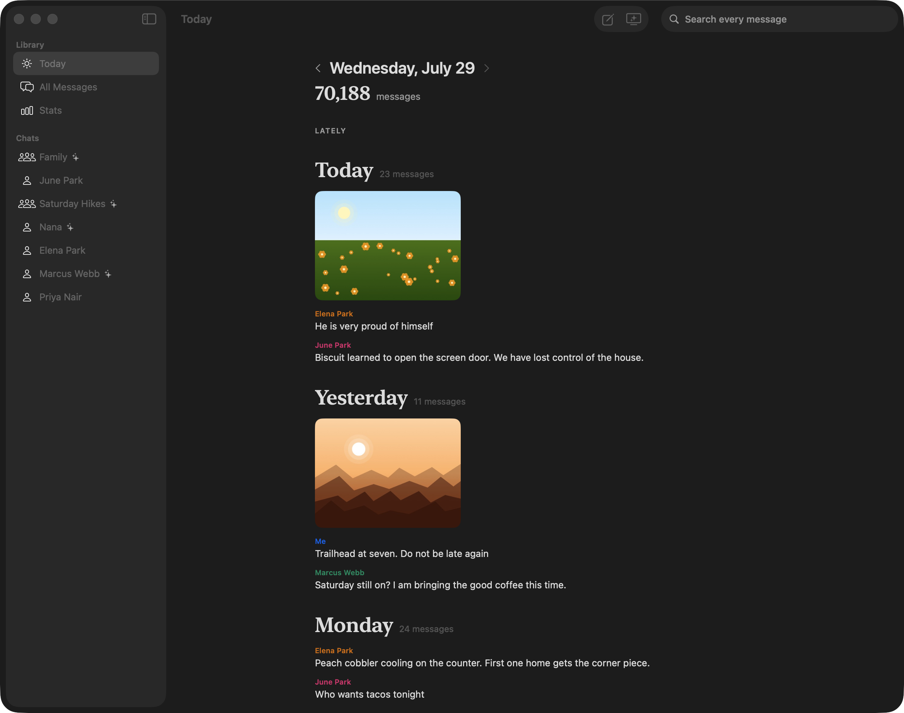
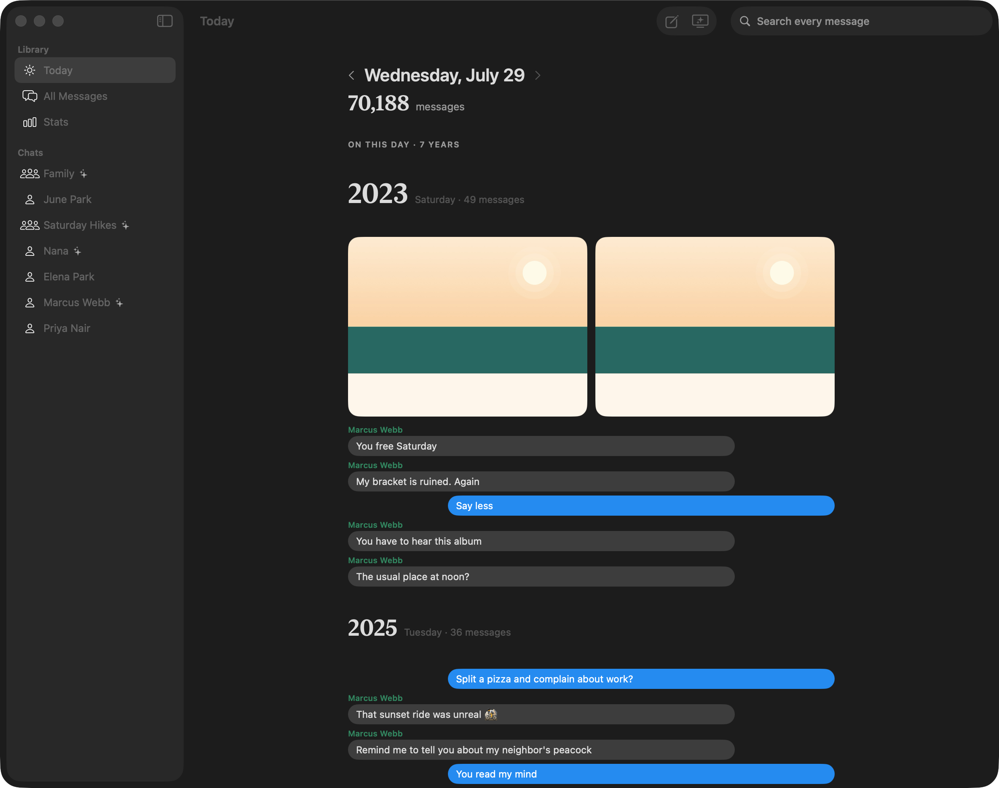
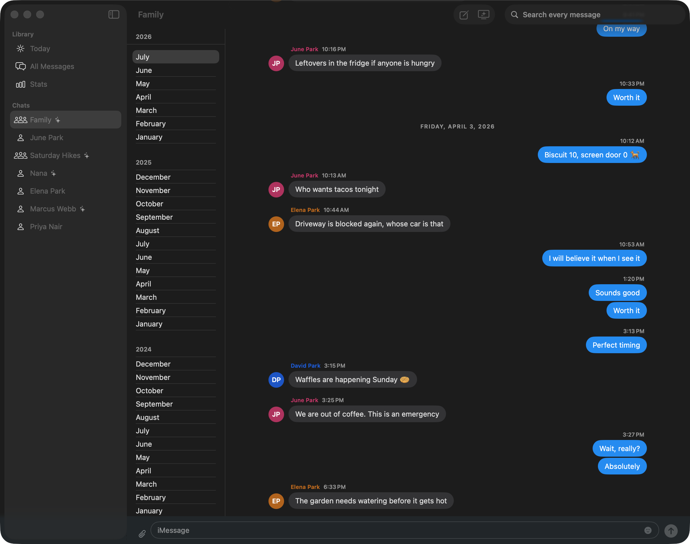
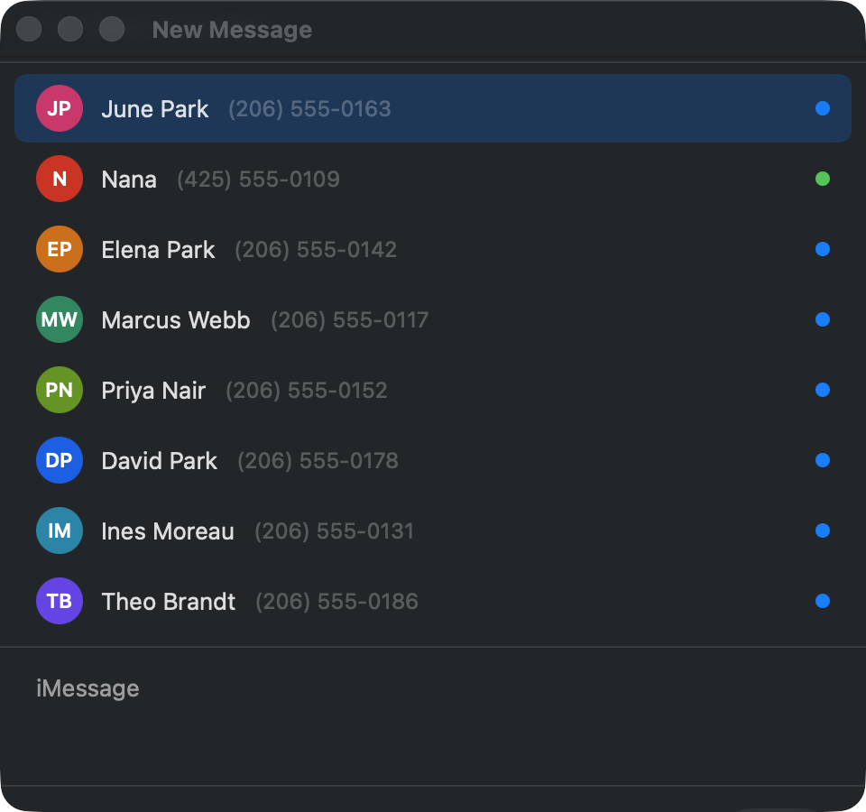
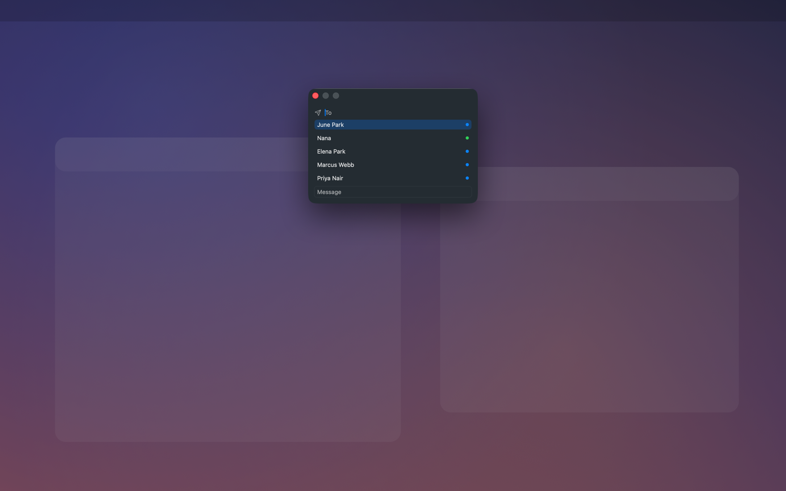
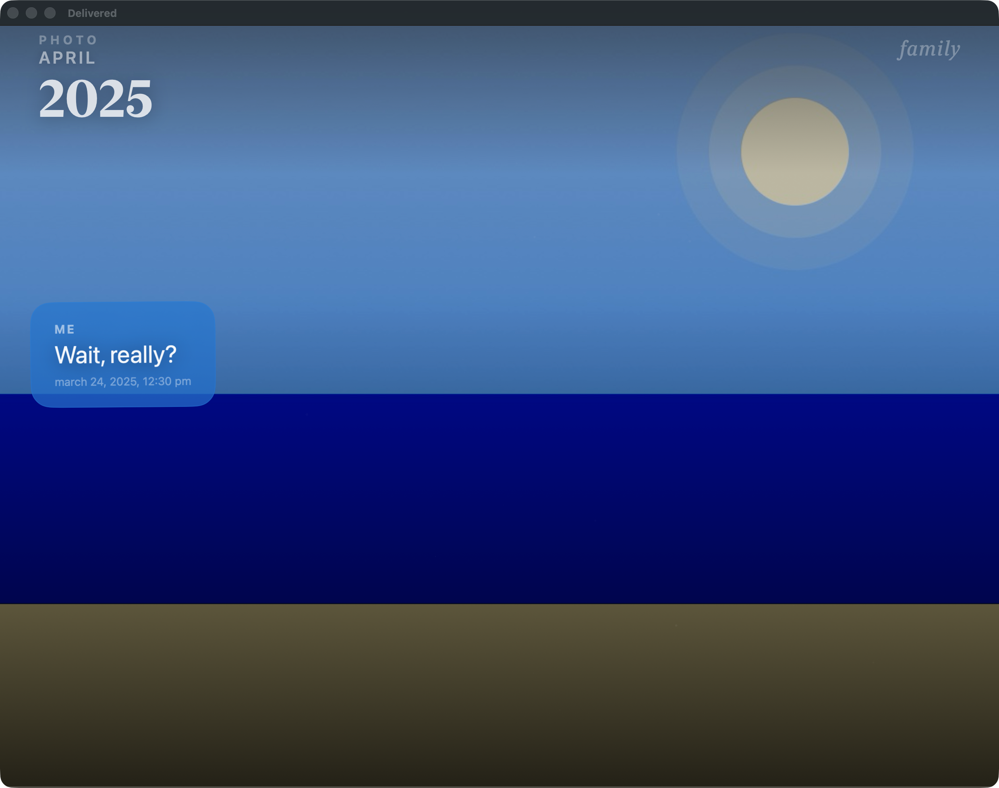
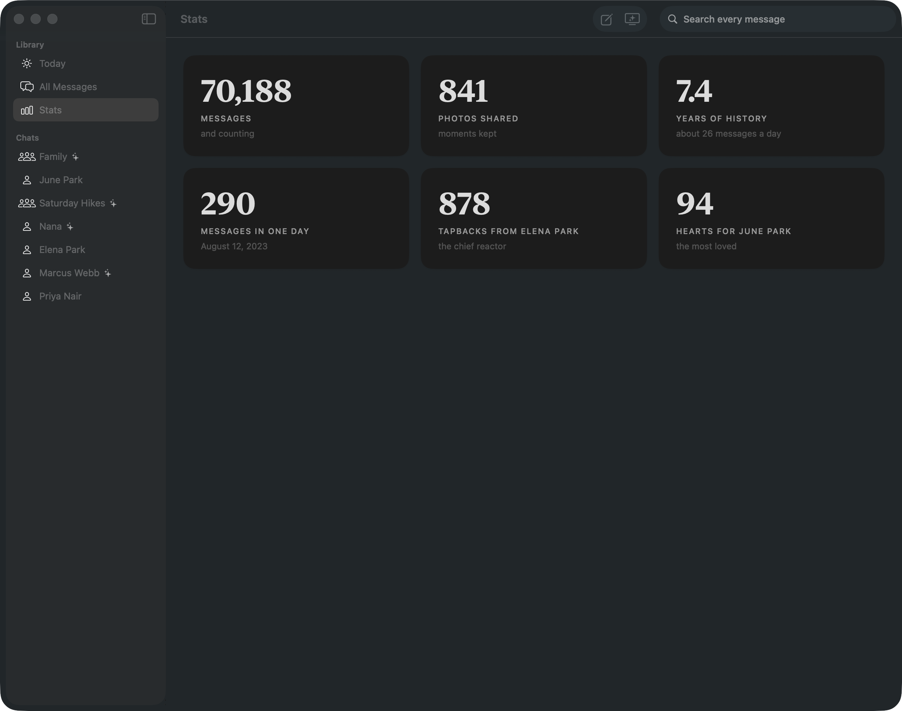
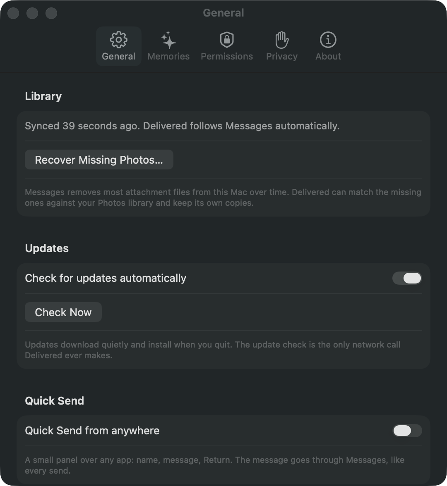

# Delivered

**The advanced view of Messages that Apple never wrote.**

Your Messages history is one of the most valuable personal datasets you
own: years of family life, decisions, jokes, photos, logistics. Apple
gives you almost nothing to do with it: search is shallow, export does
not exist, there is no API. Delivered is the missing layer: a native
macOS app that turns your Messages archive into something you can
actually search, browse, answer, export, and enjoy.

Everything stays on your Mac. The full product thesis lives in the
[product spec](product-spec.md).

## Install



1. Download the latest DMG from [Releases](../../releases).
2. Drag Delivered to Applications and open it.
3. Grant Full Disk Access when asked. The Messages database lives
   behind it, and nothing works without it. Everything else is
   optional and asked for only when you use the feature that needs
   it: Contacts turns raw phone numbers into names and photos,
   Automation lets Messages send on your behalf the first time you
   press Return on a reply, and Photos enables attachment rescue.
   Settings > Permissions shows the whole map: what each permission
   is for, its live status, and a button to grant or open it.
4. The first import reads your entire history in well under a minute,
   with progress shown as message counts. After that the library keeps
   itself current: new messages appear within seconds while the app
   is open.

Requires macOS 14 or later. Signed and notarized with a Developer ID.

## What it does

**Today** is the front door. First what happened lately, then On This
Day: a daily edition of this date across every year you have been
texting. The richest year leads, photos replay with the conversation
that surrounded them, milestones mark the first message from every
person, and `Cmd+G` opens any date you can name. Different every
morning, and every card opens the conversation at that day.





**Find** is full-text search over your entire history, sub-second at
hundreds of thousands of messages, with operators for precision (see
below). Every result is a door into the conversation at that moment.

**Browse** is the whole archive as one continuous Messages-style
transcript: bubbles, sender clustering, contact photos, tapbacks, and
video posters, with a year and month index for jumping across a
decade in one click.



**Answer** closes the loop. The archive moves you; now you can act on
it without leaving. Every conversation has a composer, Today cards
and search results grow a quick reply, and `Cmd+N` starts a fresh
conversation with anyone in your contacts, even someone you have
never texted.



And then there is Quick Send. Press `Ctrl+Option+D` in any app (the
shortcut is yours to change) and a small panel floats over whatever
you are doing: type a name, type the message, press Return, and you
never left. Esc always keeps your draft.



Sending is honest by design. Delivered never writes to your Messages
database; it asks Messages itself to send, through the same door any
Mac automation uses, with your explicit permission. You get a two
second window to catch a message before it goes, and nothing is
marked delivered until it truly lands in the archive. Failures show
themselves, amber, with a one-click retry.

**Export** turns any chat into clean Markdown or structured JSON,
filtered by person or date range, previewed before saving, with photos
and videos alongside if you want them. The formats are designed to
drop straight into an LLM context window: export your family chat and
ask Claude questions about it. A one-click "Copy as context" does the
same for search results or a whole conversation, trimmed to a sane
token budget.

**Memories** is the showcase, a fullscreen ambient mode that turns a
chat into art: photos with a slow Ken Burns drift, ambient video
clips, message bubbles from the same era floating over them, tapback
bursts, the occasional stat. It draws only from chats you explicitly
include, can start itself when your Mac goes idle, and ends the
moment you touch anything.



**The archive grows, and heals.** Merge another Mac's Messages
database and the libraries combine without duplicates. When Messages
splits one group across multiple threads (it does), they stitch back
into a single conversation. A friend who texts from a phone number
and an email is one person, one row, one history, automatically. And
because macOS quietly evicts most old attachment files from disk,
Delivered can rescue those photos from your Photos library and
restore them to Today, memories, and exports.

**And Stats keeps the superlatives**: total messages, photos kept,
years of history, the busiest day, the chief reactor, the most loved.



## For power users

Search operators compose with free text and with each other:

| operator | meaning |
|---|---|
| `from:sam` / `from:me` | messages from one person (all their handles) or from you |
| `in:"family chat"` | limit to one conversation |
| `before:2024` / `after:2023-06` | date bounds, at year, month, or day precision |
| `has:photo` / `has:video` | messages with media |

Saved searches live in the star menu next to the filters; the query is
the name.

The whole app plays keyboard: `Cmd+/` opens Delivered Help, an
instant cheat sheet of every shortcut. The ones worth memorizing:
`Cmd+F` search, `Cmd+N` new message, `Ctrl+Option+D` Quick Send from
anywhere, `Cmd+.` catches a send before it goes, `Cmd+G` opens any
date's edition, `Cmd+Shift+M` memories.

The binary is also a CLI:

```
delivered --status
delivered --export-chat <id> out.md --from sam --after 2024 --photos
delivered --export-archive family.delivered
delivered --merge-db /path/to/other/chat.db
delivered --serve-mcp
```

`--serve-mcp` runs a local MCP server over stdio with three tools
(`search_messages`, `get_transcript`, `list_chats`) so Claude and any
MCP client can search your archive without your data going anywhere.
The MCP server is read-only by design: agents can read your archive,
but only you can send.

```
claude mcp add delivered -- /Applications/Delivered.app/Contents/MacOS/Delivered --serve-mcp
```

## Settings

One window, honest throughout: your library and sync, the Quick Send
shortcut recorder, memories curation, and the permissions map with
live status and a button for each.



## Feedback

Found a bug, or want something Delivered does not do yet? [Open an
issue](../../issues) on this repository, it is the one place feedback
is tracked. A screenshot helps; remember that screenshots of your own
library contain your real messages, so crop accordingly. Help > Send
Feedback inside the app lands here too.

## Updates

Updates are unobtrusive by policy: no dialog, ever. The app checks
quietly, downloads in the background, and offers one dismissible line
in the corner of the sidebar: "1.3.0 ready, relaunch". Ignore it
and the update installs the next time you quit. Automatic checks can
be switched off in Settings. Every release is rehearsed before it
ships: the previous public build must prove it updates itself to the
new one through the real pipeline.

## Privacy

100 percent local. No accounts, no analytics, no telemetry. Delivered
reads a private, read-only snapshot of your Messages database and never
writes to Messages. Sending does not bend that: Delivered is the
button, not the pipe; Messages itself does the sending, and nothing
sends without a human pressing Return. The only network call the app
ever makes is the update check against this repository, and it can be
turned off.

Curation is absolute: nothing outside the chats you explicitly include
can appear in memories mode, a keyword blocklist is honored everywhere
quotes surface, and hiding a message takes one keystroke.

## Why not the Mac App Store

The App Store requires the App Sandbox, and a sandboxed app cannot read
the Messages database, which is the entire point. So Delivered ships
the classic Mac way: signed, notarized, direct download, self-updating.

## Colophon

Native Swift and SwiftUI, macOS 14+. Two dependencies: GRDB (SQLite +
FTS5) and Sparkle (updates). Built entirely from the terminal with
swift build and a Makefile; Xcode was never opened. This repository is
the public home: releases, the update feed, and the product spec. The
source is private for now.

The screenshots above show a demo library: the people, messages, and
photos in them are fictitious, generated by the app's demo mode, and
the desktop behind Quick Send is synthetic. Your real data never
leaves your Mac, including for marketing.

Delivered is not affiliated with Apple. Messages and iMessage are
trademarks of Apple Inc.
